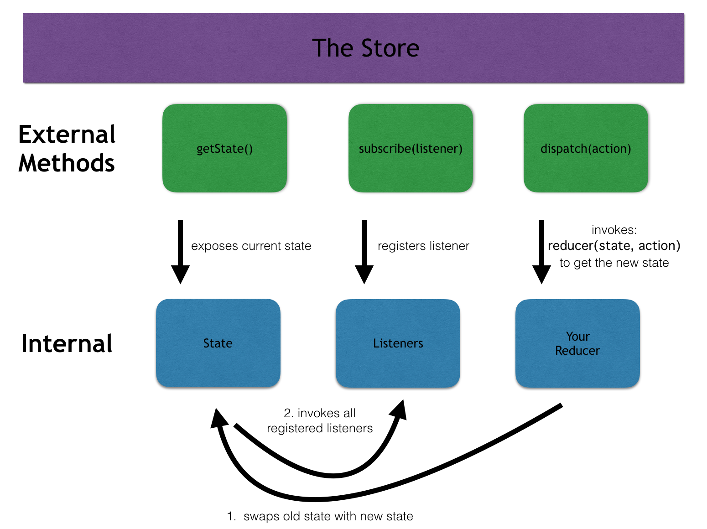
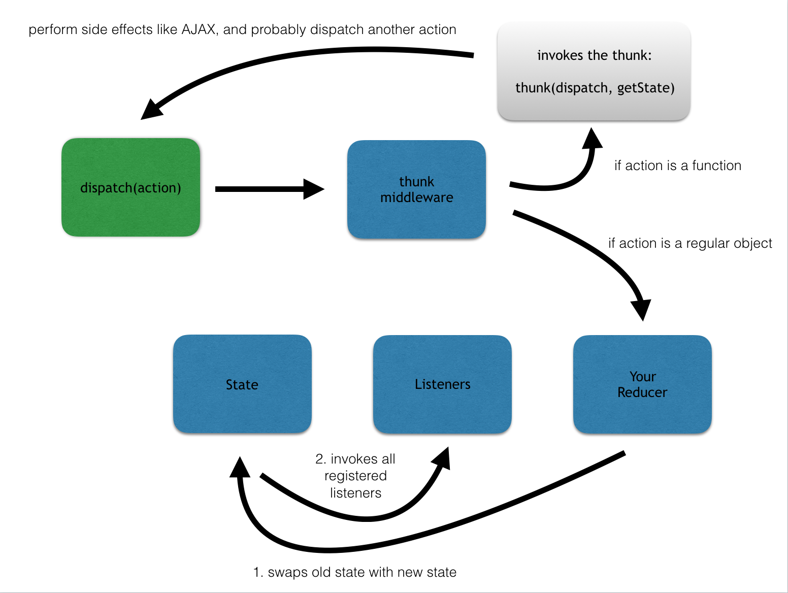

# StackChat

A chatty chat appy app. Deployed at <https://swyx-stackchat.herokuapp.com>

## Setting up

* `npm install` (or `yarn install`)
* `npm run seed`
* `npm start`

The `start` command will run both the `webpack` process (in watch mode) to build you client-side javascript files, and the Node process for your server with `nodemon`.

# Next Steps

We've covered a lot today, and learned a lot of new vocabulary. Let's take a moment to review:

# GLOSSARY OF TERMS

- Action: an object that has at least a "type" field, and any other fields needed to calculate the change to the state
- Action Creator: a function that returns an action. We write these to help us stay DRY
- Action Type: a string constant describing something that will cause the UI to update
- Middleware: functions that we can use to configure the store. These add functionality to the store when we dispatch actions. We don't know how to write our own yet (though it's not hard), so for now we get middleware from various npm packages
- Reducer: a function that we write for each app, which accepts the previous state from the Redux store as its first argument, and an action as its second argument. It should return a new state object with the changes described by the action. The reducer should be a pure function - there should be no side effects, and it should not mutate the previous state
- Store: an object created by the "createStore" function from Redux. It accepts a reducer that we write, and any number of optional middleware. It maintains a "state" object internally, which we have access to via "store.getState". When we pass an action to "store.dispatch", the store swaps out its current state with the result of invoking the reducer with the action and the current state. We can also register listeners via "store.subscribe", which the store will invoke after the state has changed
- Thunk: a function that we can pass to "store.dispatch" if we configure our store with "thunkMiddleware". If we dispatch a thunk, the thunk middleware will invoke the function and pass the store's "dispatch" and "getState" methods to it. Thunks are a desirable place to perform side effects (like AJAX requests) because it de-clutters our components, and because they make it easy to eventually dispatch other actions when some asynchronous behavior resolves

# REDUX Flowchart

The store contains three pieces of information internally:

1. The state object
2. An array of listeners
3. Your reducer, which you pass to it when you create the store

The store also exposes three public methods that you can use:

1. getState: which you can invoke to get the current state object
2. subscribe: which you can use to add a listener to the listeners array. Typically, this listeners will perform a setState for a React component
3. dispatch: which you can invoke with an action object. Every time you invoke dispatch, this triggers the following process:

- The store invokes your reducer with its current state object and the action. This returns the new state object
- The store swaps out the old state object with the new state object
- The store invokes all of the listeners in its listeners array (which you will have filled with listeners that perform setState in your components, which causes the components to re-render)

To understand how this process changes when you introduce thunks, move on to the next section.

# THUNK Flowchart

1. We dispatch something (which could be a regular action object, or a "thunk" function

2. Before the action is processed by our reducer, it is evaluated by thunk middleware.

- If thunk middleware sees that we've given it a normal object, send the action to the reducer as usual.
- Else if thunk middleware sees that we've given it a function, it invokes that function (passing it dispatch and getState). Do not move on to the reducer.
- Within our thunk function, we can perform all the side effects and AJAX we want. When we're done performing side effects, it is every likely that we will end up dispatching another action (or even another thunk), and the process repeats